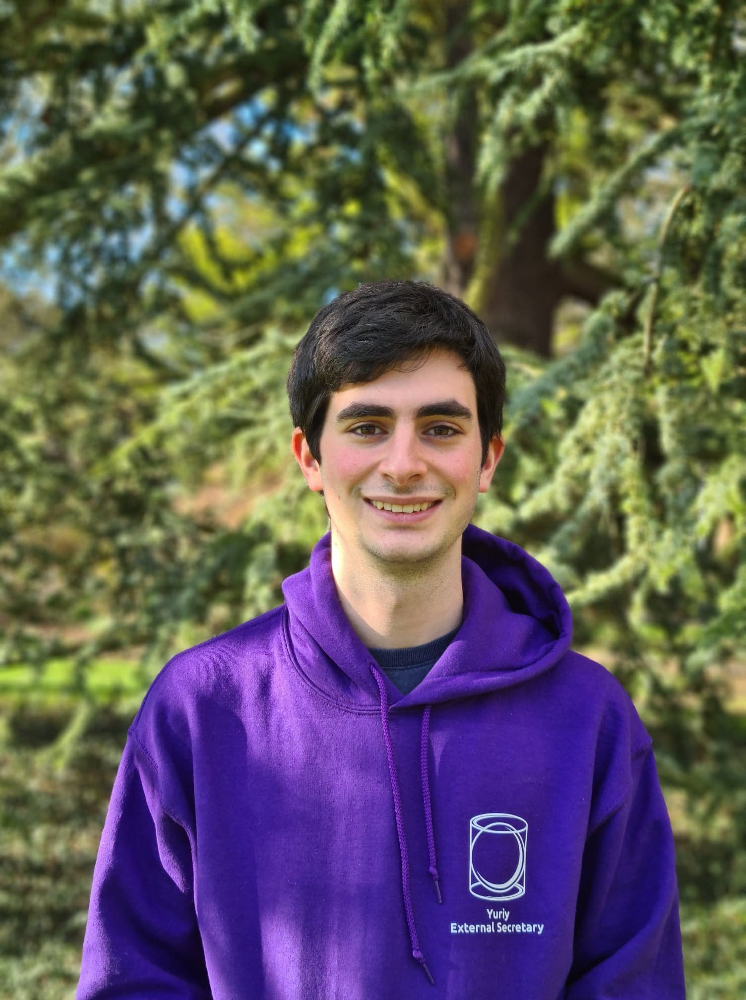

    

        
    

I'm currently a Part III (i.e. masters) mathematics student at Trinity College, Unversity of Cambridge, graduating in July 2022.

I'm most interested in geometry and dynamical systems, but have also enjoyed learning algebraic topology, number theory and representation theory.

Contact details:
- Email: yt354 *at* cam.ac.uk
- Address: Trinity College, Trinity Street, CB2 1TQ, Cambridge

